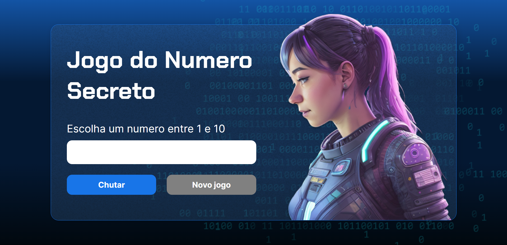
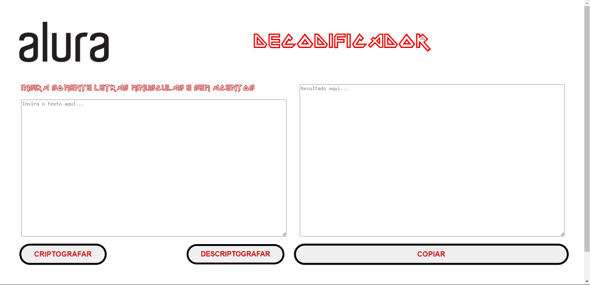

# AluraOne_course
Repository for studying the alura one training - Javascript

# Projects
## [Jogo do Numero Secreto](https://secret-number-game-dun.vercel.app/)
### Acerte o numero secreto de 1 a 10  

### Tecnologias Utilizadas:

## [Decodificador de Código](https://decodificador-sage.vercel.app/)
### Decodificador de Código para Desafio Alura One

### Tecnologias Utilizadas:

